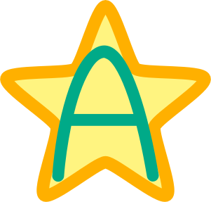

# General


This is an implementation of the `A*` path finding algoritm written in plain
Golang.
Please see [wikipedia](https://en.wikipedia.org/wiki/A*_search_algorithm) for a
description of the algorithm.



# Overview

The algorithm has been developed during the amazing [Advent of
Code](https://adventofcode.com) event in 2021.
This software is in beta state.
Development started in Dec 2021.

# How to use

The main function most users will want to use is `FindPath` in
[`astar.go`](./astar.go).
It requires a graph of nodes as input.
Assuming you want to create a regular grid of 100 nodes, you can create one like
this and find a path from the top left to the bottom right:

```go
package main

import (
    "fmt"
    "log"

    "github.com/razziel89/astar"
)

func main() {
    // 100 nodes means a 10x10 grid.
    gridSize := [2]int{10, 10}
    // We want to go to the bottom right corner...
    endPos := [2]int{9, 9}
    // ... from the top left corner.
    startPos := [2]int{0, 0}
    // We disallow diagonal movements. Thus, each node has 4
    // neighbours, 2 in x direction and 2 in y direction.
    // Create a data structure that specifies these connections.
    // The algorithm will automatically only connect to existing
    // nodes and ignore displacements that would take it beyond
    // the specified grid.
    connections := [][2]int{
        [2]int{-1, 0},
        [2]int{0, -1},
        [2]int{1, 0},
        [2]int{0, 1},
    }

    // Create the regular 2D grid including all connections as
    // specified by `connections` above. We receive a graph
    // suitable for path finding, a map from positions to nodes,
    // and possibly an error. We created a heaped graph to get
    // the best performance. The alternative would be a "default"
    // graph, which is a simpler data structure but has worse
    // performance.
    graph, posToNode, err := astar.CreateRegular2DGrid(
        gridSize, connections, endPos, "heaped",
    )
    // Error handling.
    if err != nil {
        log.Fatal(err.Error())
    }

    // Create a default, constant heuristic that estimates the
    // remaining cost as the line-of-sight distance between each
    // node and the desired destination. The value 0 is simply
    // the default estimate for unknown nodes, which is not
    // important here.
    heuristic, err := astar.CreateConstantHeuristic2D(
        posToNode, endPos, 0,
    )

    // Each node has a default cost of 0 assigned until now. To
    // create a useful example, we need to set some non-zero
    // costs on some nodes.
    for x := 0; x < gridSize[0]; x++ {
        for y := 0; y < gridSize[1]; y++ {

            // Extract the node.
            node := posToNode[[2]int{x, y}]
            // Note that we decrease the cost quadratically
            // towards x==5 and increase it for y towards higher
            // values. That way, the path through the middle is
            // preferred.
            node.Cost = (x-5)*(x-5) + 2*y

        }
    }

    // Extract start and end nodes.
    start := posToNode[startPos]
    end := posToNode[endPos]

    // Find the path! As you can see, creating the data
    // structures is the biggest headache. But this algorithm
    // permits arbitrary connections, even one-directional ones.
    path, err := astar.FindPath(graph, start, end, heuristic)
    // Error handling.
    if err != nil {
        log.Fatal(err.Error())
    }

    // Output the path we found!
    for _, node := range path {
        fmt.Println(node.ToString())
    }
}
```

The output will be this:

```
{id: x:0,y:0, cost: 25, con: ['x:0,y:1', 'x:1,y:0']}
{id: x:1,y:0, cost: 16, con: ['x:2,y:0', 'x:0,y:0', 'x:1,y:1']}
{id: x:2,y:0, cost: 9, con: ['x:1,y:0', 'x:2,y:1', 'x:3,y:0']}
{id: x:3,y:0, cost: 4, con: ['x:2,y:0', 'x:3,y:1', 'x:4,y:0']}
{id: x:4,y:0, cost: 1, con: ['x:3,y:0', 'x:4,y:1', 'x:5,y:0']}
{id: x:5,y:0, cost: 0, con: ['x:4,y:0', 'x:5,y:1', 'x:6,y:0']}
{id: x:6,y:0, cost: 1, con: ['x:5,y:0', 'x:6,y:1', 'x:7,y:0']}
{id: x:6,y:1, cost: 3, con: ['x:5,y:1', 'x:6,y:0', 'x:6,y:2', 'x:7,y:1']}
{id: x:6,y:2, cost: 5, con: ['x:6,y:1', 'x:6,y:3', 'x:7,y:2', 'x:5,y:2']}
{id: x:6,y:3, cost: 7, con: ['x:5,y:3', 'x:6,y:2', 'x:6,y:4', 'x:7,y:3']}
{id: x:6,y:4, cost: 9, con: ['x:5,y:4', 'x:6,y:3', 'x:6,y:5', 'x:7,y:4']}
{id: x:6,y:5, cost: 11, con: ['x:5,y:5', 'x:6,y:4', 'x:6,y:6', 'x:7,y:5']}
{id: x:6,y:6, cost: 13, con: ['x:5,y:6', 'x:6,y:5', 'x:6,y:7', 'x:7,y:6']}
{id: x:6,y:7, cost: 15, con: ['x:7,y:7', 'x:5,y:7', 'x:6,y:6', 'x:6,y:8']}
{id: x:6,y:8, cost: 17, con: ['x:5,y:8', 'x:6,y:7', 'x:6,y:9', 'x:7,y:8']}
{id: x:6,y:9, cost: 19, con: ['x:5,y:9', 'x:6,y:8', 'x:7,y:9']}
{id: x:7,y:9, cost: 22, con: ['x:8,y:9', 'x:6,y:9', 'x:7,y:8']}
{id: x:8,y:9, cost: 27, con: ['x:7,y:9', 'x:8,y:8', 'x:9,y:9']}
{id: x:9,y:9, cost: 34, con: ['x:8,y:9', 'x:9,y:8']}
```

As you can see, you get a nice string representation of the path.
The algorithm has found the best path by first going to the middle in x
direction, then upwards (positive y direction), and then to the right again
once it cannot avoid it.
Basically the path looks like this, with `.` being empty spaces and `#` being on
the path, `S` is the start and `E` is the end:

```
. . . . . . # # # E
. . . . . . # . . .
. . . . . . # . . .
. . . . . . # . . .
. . . . . . # . . .
. . . . . . # . . .
. . . . . . # . . .
. . . . . . # . . .
. . . . . . # . . .
S # # # # # # . . .
```

# Installation

Simply add `github.com/razziel89/astar` as a dependency to your project by
running:
```bash
go get github.com/razziel89/astar@latest
```
Then, use as in the example above!

# How to contribute

If you have found a bug and want to fix it, please simply go ahead and fork the
repository, fix the bug, and open a pull request to this repository!
Bug fixes are always welcome.

In all other cases, please open an issue on GitHub first to discuss the
contribution.
The feature you would like to introduce might already be in development.

# Licence

[GPLv3](./LICENCE)

If you want to use this piece of software under a different, more permissive
open-source licence, please contact me.
I am very open to discussing this point.
